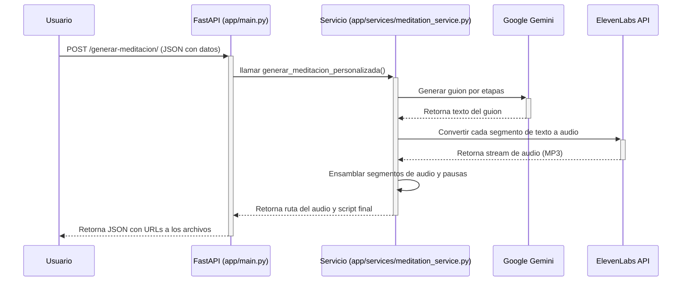

# Meditación AI - Servicio de Generación de Audio Personalizado

Este proyecto es una API RESTful construida con FastAPI que genera dinámicamente audios de meditación guiada personalizados. Utiliza modelos de lenguaje de IA para crear el guion y un servicio de Texto-a-Voz (TTS) para producir el audio.

## ✨ Características Principales

*   **Personalización Profunda**: Genera meditaciones basadas en el nombre del usuario, su estado emocional y sus objetivos.
*   **IA Generativa para Guiones**: Utiliza Google Gemini a través de LangChain para crear guiones de meditación coherentes y relevantes.
*   **Voz Natural y Serena**: Emplea ElevenLabs para convertir el guion en un audio con una voz de alta calidad, configurada para un tono de calma.
*   **Duración Ajustable**: El sistema intenta ajustar la duración del guion para que coincida con el tiempo solicitado por el usuario.
*   **API Robusta**: Construido sobre FastAPI, ofrece un rendimiento rápido, documentación automática de la API (Swagger UI) y validación de datos con Pydantic.
*   **Manejo de Pausas**: Interpreta marcadores especiales en el guion como `(PAUSA_MEDIA)` para insertar silencios y mejorar el ritmo de la meditación.

## 🏗️ Arquitectura del Sistema

El flujo de trabajo del sistema es sencillo pero potente. El usuario envía una solicitud a la API, que orquesta la generación del guion y el audio, y finalmente devuelve las URLs para acceder a los archivos generados.



## 📂 Estructura del Proyecto

El proyecto sigue una estructura modular para facilitar la mantenibilidad, la escalabilidad y las pruebas.

```
/meditate
├── app/
│   ├── __init__.py
│   ├── main.py             # Lógica de FastAPI, endpoints y router.
│   ├── services/
│   │   ├── __init__.py
│   │   └── meditation_service.py # Lógica de negocio (Gemini, ElevenLabs).
│   ├── models/
│   │   ├── __init__.py
│   │   └── meditation_models.py  # Modelos Pydantic (Request/Response).
│   └── core/
│       ├── __init__.py
│       └── config.py             # Carga de configuración y variables de entorno.
│
├── generated_media/        # Directorio para audios y scripts generados.
│   └── .gitkeep
│
├── tests/                  # Directorio para las pruebas.
│   ├── __init__.py
│   └── test_meditation_api.py
│
├── .env                    # Archivo de variables de entorno (¡no subir a git!).
├── .gitignore
├── requirements.txt
└── README.md               # Este archivo.
```

## 🚀 Instalación y Ejecución

1.  **Clonar el repositorio:**
    ```bash
    git clone <URL_DEL_REPOSITORIO>
    cd meditate
    ```

2.  **Crear un entorno virtual e instalar dependencias:**
    ```bash
    python3 -m venv venv
    source venv/bin/activate
    pip install -r requirements.txt
    ```

3.  **Configurar las variables de entorno:**
    Crea un archivo llamado `.env` en la raíz del proyecto y añade tus claves de API:
    ```env
    # Clave de API de Google para el modelo Gemini
    GOOGLE_API_KEY="TU_API_KEY_DE_GOOGLE"

    # Clave de API de ElevenLabs
    ELEVENLABS_API_KEY="TU_API_KEY_DE_ELEVENLABS"

    # (Opcional) ID de la voz de ElevenLabs que deseas usar
    ELEVENLABS_VOICE_ID="pNInz6obpgDQGcFmaJgB"
    ```

4.  **Instalar FFmpeg:**
    Pydub necesita FFmpeg para procesar audio. Asegúrate de que esté instalado en tu sistema.
    *   **macOS (con Homebrew):** `brew install ffmpeg`
    *   **Ubuntu/Debian:** `sudo apt update && sudo apt install ffmpeg`

5.  **Ejecutar la aplicación:**
    ```bash
    uvicorn app.main:app --reload
    ```

6.  **Acceder a la documentación de la API:**
    Abre tu navegador y ve a [http://127.0.0.1:8000/docs](http://127.0.0.1:8000/docs) para ver la interfaz de Swagger UI.

## ✅ Pruebas

El proyecto utiliza `pytest` para las pruebas. Las pruebas están diseñadas para ejecutarse de forma aislada sin necesidad de llamadas a APIs externas, gracias al uso de mocks.

1.  **Instalar dependencias de desarrollo (si aún no lo has hecho):**
    ```bash
    pip install pytest
    ```

2.  **Ejecutar las pruebas:**
    Desde el directorio raíz del proyecto, ejecuta:
    ```bash
    pytest
    ```

## ⚙️ Uso de la API

You can generate a new meditation by sending a `POST` request to the `/generar-meditacion/` endpoint.

**Ejemplo con `curl` (Inicio de Generación):**

```bash
curl -X 'POST' \
  'http://127.0.0.1:8000/generar-meditacion/' \
  -H 'accept: application/json' \
  -H 'Content-Type: application/json' \
  -d '{
  "nombre_usuario": "Elena",
  "emocion_reconocida": "ansiedad por el futuro",
  "objetivo_meditacion": "encontrar calma y aceptación en el presente",
  "duracion_minutos": 10
}'
```

**Respuesta exitosa (código `202 Accepted`):**

```json
{
  "message": "Generación de meditación iniciada en segundo plano. Se notificará vía webhook al finalizar.",
  "task_id": "meditation_1751341245"
}
```

**Ejemplo de Payload del Webhook (POST a `WEBHOOK_URL`):**

```json
{
  "task_id": "meditation_1751341245",
  "status": "completed",
  "message": "Audio y script de meditación generados exitosamente.",
  "audio_url": "/media/meditacion_elena_1751341245.mp3",
  "audio_file_path": "/Users/aaronvaldes/meditate/generated_media/meditacion_elena_1751341245.mp3",
  "script_url": "/media/meditacion_elena_1751341245.txt",
  "script_file_path": "/Users/aaronvaldes/meditate/generated_media/meditacion_elena_1751341245.txt"
}
```

O en caso de error:

```json
{
  "task_id": "meditation_1751341245",
  "status": "failed",
  "message": "Error inesperado durante la generación de meditación: Fallo al generar el guion con la IA: ..."
}
```
